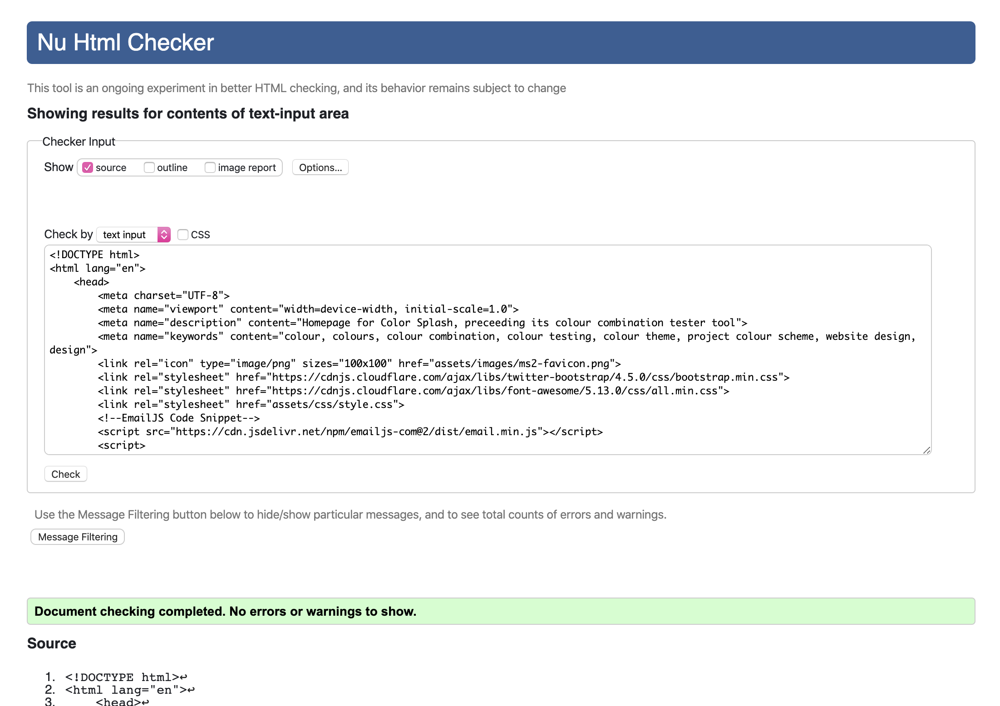
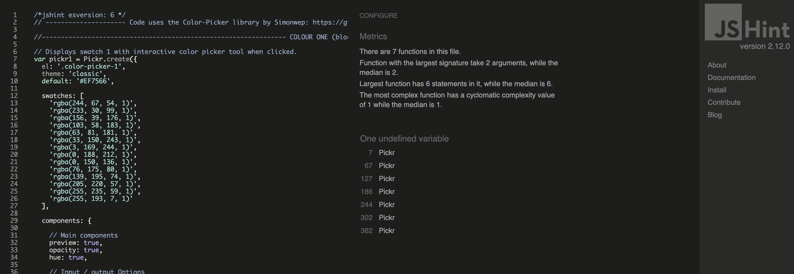
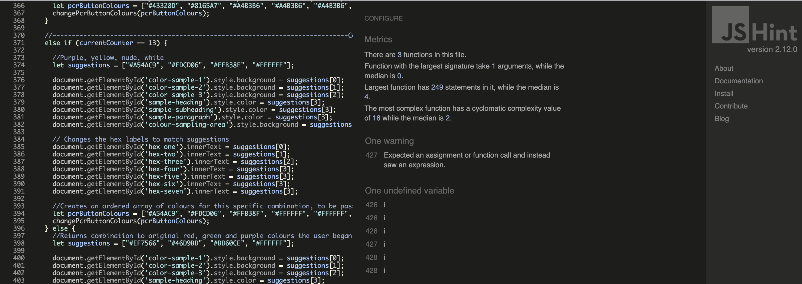

# Testing

[Back to README.md file](README.md)

## Table of Contents
1. [Testing User Stories](#testing-user-stories)
2. [DevTools](#dev-tools)
    * [Responsiveness](#responsiveness)
    * [Console Debugging](#console-debugging)

3. [Manual Testing](#manual-testing)

4. [Automated Testing](#automated-testing)
    * [Code Validation](#code-validation)
    * [Browser Validation](#browser-validation)
    
5. [User Testing](#user-testing)
    * [Mentor Review](#mentor-review)
    * [User Review](#user-review)

## Testing User Stories 

*"1. As a new user, I want to find it easy to navigate the website and find the testing tool."*

There is a clear, bold Call to Action button before the user as soon as they enter the website. The menu remains fixed as the user scrolls so that they can always navigate to a different page. As the homepage is quite a long page, a button appears on a screen position of 300px or greater, which the user can click to return to the top of the page (signaled by the upward arrow icon).

*"2. As a new user who is not a designer/developer, I want to find inspiration with attractive example colour combinations.*

The 'Ideas' control on the Tester page presents the user with 13 different colour combinations. The user might decide to export these verbatim or they can alter them a little/a lot at any time using the colour pickers.

*"3. As a new user, I want to find instructions for using the site most effectively for my needs."*

There are three simple steps on how to use the tester as soon as they enter the site (on larger screens, in the jumbotron, on smaller screens, below the jumbotron). The 'magic' number three ensure the steps do not seem too completed and the visual presentation and colour scheme makes the instructions interesting. On the Tester page, there is also a 'Help' button which reveals more detailed instructions, including visual hints for the swatches and colour pickers.

*"4. As an existing user, I want to export a text copy of my chosen colour combination to my device, so I can refer back to it after closing the Colour Splash website."*

Clicking the 'Share' control on the Tester page downloads a colour-combination.txt file to the user's device. Opening the file reveals the hex colours of the colour combination they had selected in the tool at the time they pressed 'Share'. The hex numbers are labelled with which sample they refer to (text, background etc.).

*"5. As an existing user, I want to be able to contact the owner of the site with a question about, or problem with, using the website."*

At the bottom of the Homepage is a large question mark image followed by the text 'Have a question?', immediately signaling to the user that there is an option to contact the Colour Splash team. The Call to Action 'Get in Touch' below this prompts the user to click it by increasing in size when it is hovered over. Clicking the button reveals a form where the user can input their name, reply email and message, and then submit. The user also receives a confirmation of their enquiry in their inbox.

*"6. As a new user, I want assurance that others recommend the use of this tool."*

The reviews section below the jumbotron on the homepage show happy users of the tool. They are short so they can be quickly glanced over and there are reviewer names attached below them to indicated a level of trustworthiness i.e. they are indeed real comments by real people.

*"7. As an existing user, I want to be able to reset my colour selection and begin over."*

The 'Refresh' control allows the user to reset their workspace should they wish to start over. The modal which pops up first ensures the user does indeed wish to refresh and avoids the user losing their current selection by accidentally pressing the button.

*"8. As an existing user, I want to experiment with shades of colours, which update and display instantaneously for me to see."*

The gradient position of the sliders on the colour pickers update their corresponding their block, text or background sample instantaneously. Thus, a user can slide through different colours, shades of colours or opacities and see the results immediately in the tool.

*"9. As an existing user with a colour selection already in mind, I want to input a HEX or RGBA number directly into the colour picker."*

A user can directly input a HEX or RGBA number in the colour picker in the bottom left-hand corner. They just need to ensure 'HEX' or 'RGBA' is correctly selected next to this box. The colour is displayed in the corresponding sample instantaneously. 

## DevTools

By editing the HTML or CSS code displayed in DevTools, it could be established what changes were necessary to fix spacing/layout problems, without changing the actual files. Reloading DevTools and the original code in the browser is far easier then having to restore a file. 

### Responsiveness 
This project uses Bootstrap and its grid system to ensure a responsive layout. This was tested in DevTools by viewing the website on every screen size, the smallest being an iPhone 5C and the largest being a laptop with HiDPI screen.

Multiple media queries for each Bootstrap cutoff point are set at the end of the style.css file to optimise layout and display on different screen widths.

All responses to screen size changes were suitable except on screen sizes below 442px. For this reason, media queries which did not target the conventional Bootstrap cutoff points were used to accommodate for tiny changes to layout/margins/padding on extra-small screens.

### Console Debugging
Viewing the console in DevTools was a useful way to debug this project's Javascript code: 
- The failure to load the backToTopButton.js indicated the script tag for this file path had failed to be included at the bottom of the index.html. 
- By logging to console a message each time a Javascript function was or was not called, it could be identified whether a function was successfully working or whether it had an unidentified bug.

## Manual Testing

### Menu 

- Logo - clicking takes the user to the homepage.

-Home link - hovering over changes the text colour to black. Hovering off reverses this. Clicking takes the user to the homepage.

- Tester link - hovering over changes the text colour to black. Hovering off reverses this. Clicking takes the user to the tester page.

- Navbar position - remains in a fixed position when the user scrolls.

### Headings

- Main heading - hover on the text changes the gradient colour to red. Hover off changes the colour back to the gradient colour.

### Homepage

- CTA 'Get Started' Button - hovering over the button increases it in size via a smooth transition. Hovering off reverses this. Clicking the button takes the user to the Tester page.

- Three steps image - on small screens and lower, the three steps image in the jumbotron disappears and three full width blocks with the same information appear below the reviews.

- Reviews - on medium screens, the outer most reviews on the left and right no longer display and on small screens and lower, no reviews display.

- Back to top button - on a scroll position of 300px or greater, the button appears in the bottom right-hand corner and at a position of less than 300px it does not display. Clicking the button returns the user to the very top of the page.

- 'Get in touch' button - hovering over the button makes it smoothly grow in size, and hovering off reverses this. Clicking expands a contact form below it and clicking again collapses it.

- Contact form (inputs) - 'Name', 'Email' and 'Message' are all required inputs in order to submit the form. 

- Contact form (submit button) - hovering over the button increases it in size, and hovering off reverses it. Clicking the button submits the user's inputs.

- Contact form (after submit) - a green success message appears below the submit button, the input fields are cleared and an email confirmation is sent to the user's provided email address.

### Tester page

- Controls - each control on hover changes to a grey background with white text. Hover off reverses this. 

- Ideas (control) - clicking changes the entire testing section to the first colour combination. Clicking again changes it to the second combination and so on. There are a total of 13 combinations to cycle through and the combination number is logged to console successfully each time. After the 13th, the orginal red, green and purple block colours display once more. Clicking the control again will allow the user to cycle through the same 13 combinations, facilitated by the resetting of the counter in combinationGenerator.js on the 14th click. Both the swatch colours and hex numbers change correctly to match the displayed colours.

- Resfresh (control) - clicking triggers a modal to drop down from the top of the screen. The option 'Cancel' simply dismisses the modal while the 'Yes, refresh' option refreshes the Tester page.

- Share (control) - clicking triggers a download of a text file called colour-combination.txt to the user's device. The file contains the hex numbers of all seven colours currently selected by the user on the Tester page. They are organised with the labels 'Blocks' 1-3, 'Text' 1-3 and 'Background'.

- Help (control) - clicking triggers a modal to drop down from the top of the page. Clicking the 'Got it!' button dismisses the modal, as does clicking anywhere outside of the modal.

- Swatches - the top three swatches correspond to the sample blocks' colours, the next three correspond to the three sample pieces of text's colours, and the final swatch corresponds to the background colour. On click, each opens up a colour picker. On small screens and below, the swatches display in a horizontal line below the sample blocks.

- Colour picker - each colour picker has a slidable button on the displayed colour gradient. The change in the position of the slider causes an immediate change in the colour of the corresponding sample. Clicking 'Save' saves the currently selected colour to the swatch (it changes colour).

- Hex numbers - the hex numbers change to whatever colour is selected in the colour picker and so always matches the samples. The hex numbers do not display on medium screens and below.

## Automated Testing

### Code Validation

- This project used [Free Formatter]([https://www.freeformatter.com](https://www.freeformatter.com/)) to format HTML, CSS and Javascript code.

- This project used the [W3C Markup Validation Service]([https://validator.w3.org/](https://validator.w3.org/)) to validate HTML code.

    

    

- This project used the [W3C CSS Validation Service]([https://validator.w3.org/](https://validator.w3.org/)) to validate CSS code.

    

- This project used the [JSHint website]([https://jshint.com/](https://jshint.com/)) to validate Javascript code.

### Browser Validation

- Chrome - displays correctly [(view here).](assets/images/readme-images/opening-html.png)
- Safari - displays correctly [(view here).](assets/images/readme-images/safari.png)

- [Autoprefixer CSS online](https://autoprefixer.github.io/) was used to add the necessary prefixers to CSS so that the live website renders across all other browsers.

### Device Validation

The website displays correctly on all of the following device types (tested via DevTools):

- iPhone 5C
- iPhone 6/7/8
- Galaxy S5
- Pixel 2
- Pixel 2 XL
- iPhone X
- iPhone 6/7/8 Plus
- iPad
- iPad Pro
- Laptop with touch
- Laptop with MDPI screen
- Laptop with HiDPI screen

## User Testing

### Mentor Review

Seun loved the aesthetic of the homepage and the consistency in colours. She used the colour pickers on the Tester page easily and found all buttons to work as expected.

Seun made the following suggestions:

- Make the navbar fixed so that it is always accessible to the user on any scroll position.
- Add a "back to top" button to the homepage, so that on a screen position of 300px or greater, a button appears in the bottom right hand corner. When the user clicks it, they are returned to the top of the homepage.
- Make the swatches, which toggle the colour pickers on Tester page, display horizontally below the tester blocks on smaller screens. This way, every feature in the testing area has sufficient room to be displayed and avoids being 'crammed in'.
- Make the swatch colours change to match the current colours displayed when the user clicks the 'Ideas' control on the Tester page. This was something which this project had tried to implement in Javascript but to no avail. Seun helped with a solution to this.
- The contact form should drop down in the center of the page on larger screens, as it already did on smaller screens.
- Include a Copyright clause in the footer of each page for a more professional finished look.

### User Review

This Colour Splash website was tested by friends and family. The overall feedback was very positive. In particular the 'Ideas' feature was greatly appreciated for those who did not consider themselves good at design and wanted inspiration. 

Suggested improvements were as follows:

- Within the 'Help' modal, less technologically savvy users did not understand the terms 'swatch' or 'colour picker', so an inclusion of visual examples of these features were included to aid understanding.
- Similarly, what each swatch corresponded to was not clear to first time users, thus the labels 'Swatches' and sub-labels 'Blocks', 'Text' and 'Background' were added for clarity. It was felt that the order of swatches (1-3) corresponding to the same order of blocks (1-3) and text (1-3) was intuitive, so there was no need to include more explicit labeling.
- Originally the sample block on the Tester page had margins between them. However, it was suggested that a better layout for colour comparison would be to remove these gaps so that the blocks fitted together.
